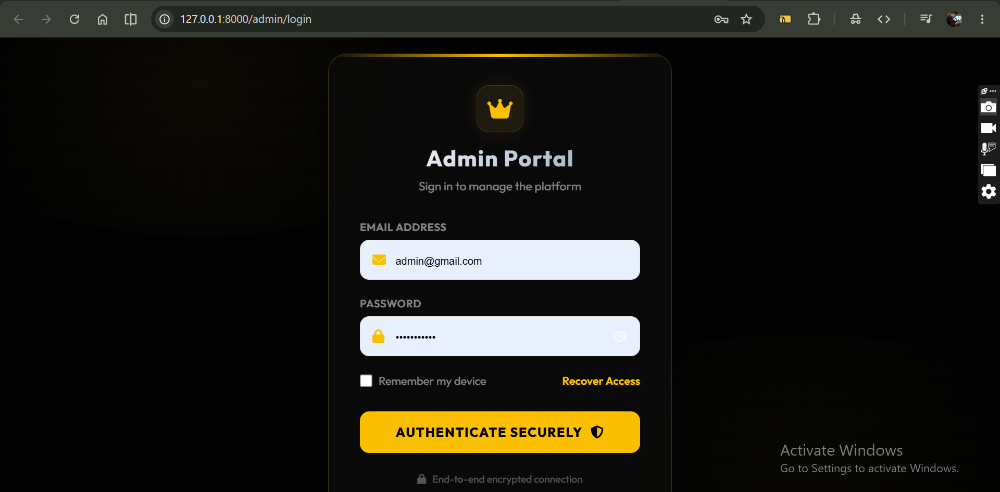
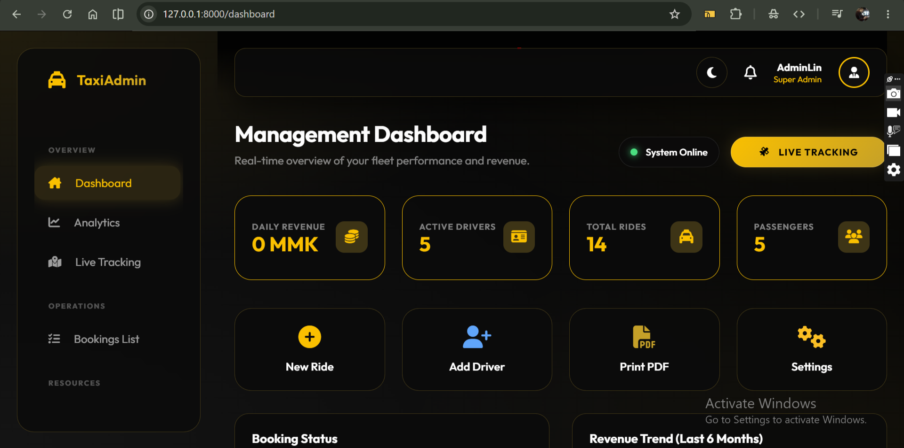
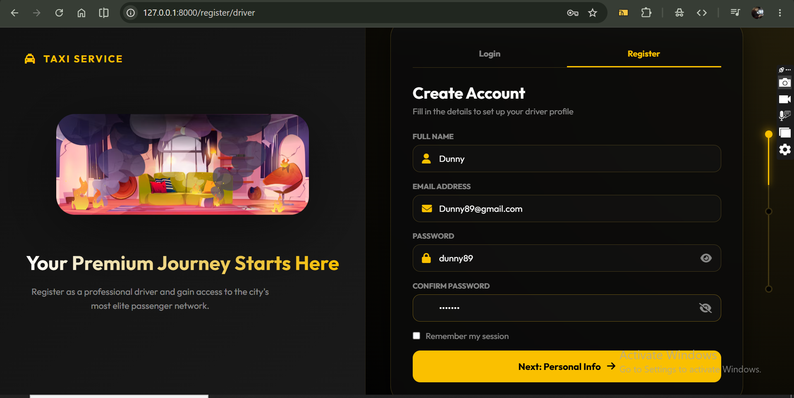
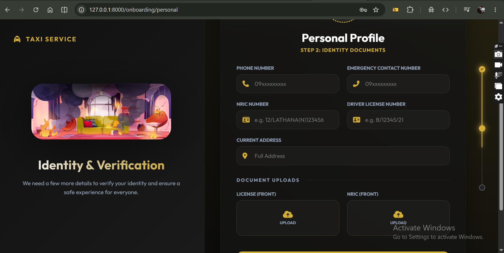
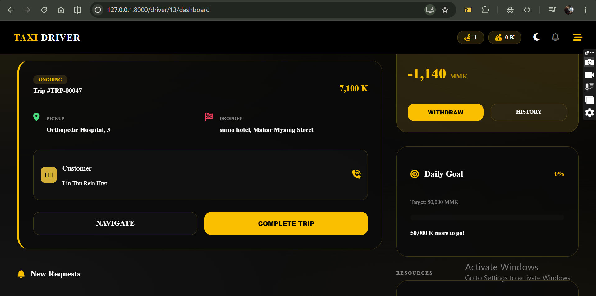
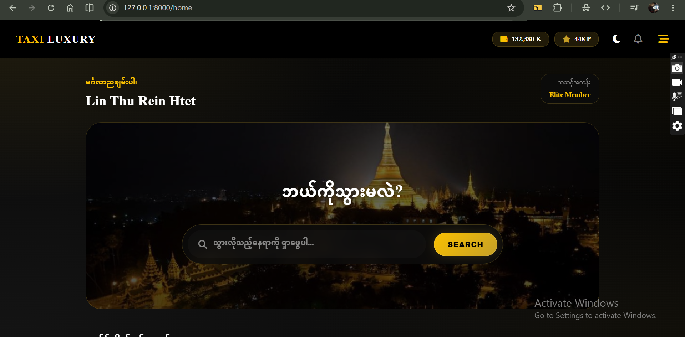
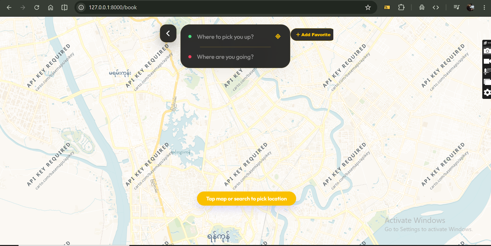

# 🚖 Comprehensive Taxi Booking & Management System

> **Note to Visitors & Recruiters:** 
> This is a robust conceptual project I developed to master complex backend architectures in Laravel. Rather than a simple CRUD app, this system explores **Multi-Guard Authentication**, **Real-time State Management**, and **Financial Ledgers** across three completely distinct user roles: Admin, Driver, and Customer.

## 📸 System Workflows & Previews

### 👨‍💼 1. Admin Flow (Ecosystem Management)
The Admin panel acts as the central brain of the application, managing users, verifying driver vehicles, processing withdrawal requests, and overseeing all transactions.

| Admin Login | Admin Dashboard |
|:---:|:---:|
|  |  |

### 🚖 2. Driver Flow (Ride & Earnings Management)
Drivers have their own dedicated ecosystem. They can register their vehicles, toggle their online status, accept bookings, and track their financial ledgers (earnings and withdrawals).

| Driver Registration | Driver Dashboard | Driver Panel |
|:---:|:---:|:---:|
|  |  |  |

### 🙍‍♂️ 3. Customer Flow (Booking & Tracking)
Customers can easily request rides, save their frequent destinations, use reward points, and chat with drivers.

| Customer Booking | Customer Tracking |
|:---:|:---:|
|  |  |

---

## 🚀 Core Technical Features Explored

### 🔐 Multi-Guard Authentication
Implemented distinct authentication guards (web, driver, customer) with separated routing files (dmin.php, driver.php, customer.php) to ensure strict security and separation of concerns.

### 📍 Ride Dispatch & State Machine
Engineered a comprehensive Booking model that handles complex state transitions (Pending -> Accepted -> In Transit -> Completed/Canceled). It pairs with an OnlineLog to dispatch rides only to active drivers.

### 💰 Financial Ledger & Wallets
Developed a double-entry style Transaction system.
*   **Earnings:** Automated calculation of driver payouts vs platform commission per ride.
*   **Withdrawals:** A request-and-approval system for drivers to cash out.
*   **Rewards:** A PointReward system to incentivize customer retention.

### 💬 Internal Communication Engine
Built a custom ChatMessage and Notification system allowing seamless communication between drivers and customers without relying on third-party services.

## 🛠️ Tech Stack & Architecture

*   **Framework:** Laravel (PHP)
*   **Database:** MySQL / SQLite (Eloquent ORM)
*   **Architecture Pattern:** Modular MVC (Separated Auth/Core models)
*   **Frontend Rendering:** Laravel Blade

---
*Built as part of my continuous learning journey to architect scalable and complex web applications.*
